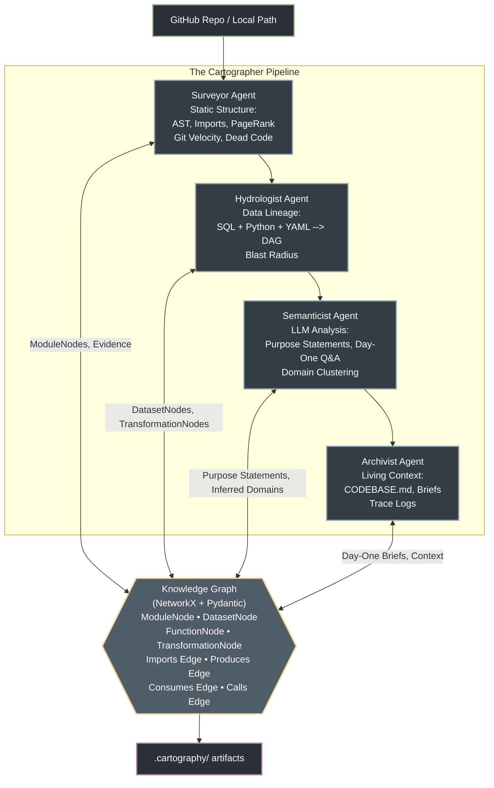

# The Brownfield Cartographer — Interim Submission Report

**Engineer:** Lidya  
**Target Codebase:** `dbt-labs/jaffle-shop`  
**Date:** March 12, 2026  
**Branch:** `issue/interim-hardening`

---

# 1. RECONNAISSANCE.md — Manual Day-One Analysis

## The Investigative Process: How I mapped this "Blind"

I didn't start with a high-level summary. I started by following the data.

1. **Entry Point Hunt**: I looked for a `README.md` and `dbt_project.yml`. The project is small but has the standard dbt "layered" structure.
2. **The Seed Lead**: I found `seeds/jaffle-data`. This is the "Ground Zero."
    ```yaml
    # models/staging/__sources.yml
    sources:
      - name: ecom
        schema: raw
        tables:
          - name: raw_customers
    ```
3. **The Staging Bridge (The "Lie")**: The code claims to point to a `raw` schema, but the data is physically static CSVs.
    > **WARNING:** For the Cartographer, this "Staging Bridge" lie is a critical edge case. If the parser only looks at SQL `source()` calls without resolving the YAML metadata to the physical filesystem (seeds), it will report a broken upstream dependency. The Cartographer must unify the logical "raw" schema with the physical `seeds/` path.
4. **The Marts Logic**: I spent 10 minutes tracing the relationship between `customers.sql` and `orders.sql`.

## The Five FDE Day-One Questions (Evidence-Backed)

### 1. What is the primary data ingestion path?
It's a "Seed-to-Staging" flow.
- **Physical Source**: `seeds/jaffle-data/*.csv`
- **First-touch Code**: `models/staging/stg_*.sql` which use the `{{ source('ecom', ...) }}` macro

### 2. What are the 3-5 most critical output datasets?
1. **`marts/customers`** (7 commits): The "Golden Record."
2. **`marts/orders`** (12 commits): The transactional truth.
3. **`marts/order_items`** (9 commits): The junction of products and supplies.

### 3. What is the blast radius of a `stg_orders` failure?
**Catastrophic.**
- `stg_orders` → `marts/orders` → `marts/customers`
- **Evidence**: `models/marts/customers.sql:11` explicitly uses `ref('orders')`.
- **Radius**: All downstream marts depending on `orders`.

### 4. Logic Concentration: Where is the "Brain"?
Concentrated in the **Marts Layer**.
- **Staging** is "janitor work": casting types, renaming `id` to `customer_id`.
- **Marts** is where the business lives: LTV aggregations and customer classification.

### 5. Git Velocity: Quantified (All-Time Commits)

*(Measured via `git log --oneline -- <file> | wc -l`)*

| Path | Commits | Role |
|:-----|:--------|:-----|
| `models/marts/orders.sql` | 12 | Core Transaction Logic |
| `models/marts/order_items.sql` | 9 | Granular Details |
| `models/staging/__sources.yml` | 9 | Metadata Registry |
| `models/marts/customers.sql` | 7 | Identity/LTV Logic |
| `models/staging/stg_orders.sql` | 6 | High-Impact Source |

## Core Architecture Observation (Materializations)
Most **marts** use `table` materialization (heavy reads, complex joins).
Most **staging models** are likely configured as `views` (lightweight casting/renaming). This fits standard dbt best practices perfectly.

## What Was Hardest / Where I Got Lost

1. **The `source()` → seed indirection**: I initially assumed `source('ecom', 'raw_customers')` pointed to a real database table.
2. **The `cents_to_dollars` macro**: Used in 4 staging models. Without reading `macros/cents_to_dollars.sql`, I couldn't tell if it had business logic.
3. **Window function semantics**: Understanding `partition by customer_id` required reading the full CTE chain.
4. **The `metricflow_time_spine`**: Zero `ref()` calls — initially looked like orphaned dead code. The important insight is that this model is **used by MetricFlow to support time-based metric joins**.
5. **Jinja templating in SQL**: Static SQL parsers struggle significantly with dynamic template tags like `{{ source('ecom','raw_customers') }}` and `{{ ref('orders') }}` without an active dbt compilation context. Translating these macros into stable graph edges is the primary challenge of the Surveyor phase.

---

# 2. Architecture Diagram: Four-Agent Pipeline

## Pipeline Data Flow



### Technology Stack
| Component | Library | Purpose |
|:----------|:--------|:--------|
| AST Parsing | `tree-sitter` + `tree-sitter-languages` | Multi-language structural analysis |
| SQL Parsing | `sqlglot` | Column-level lineage, dialect support |
| Graph Engine | `NetworkX` | DiGraph, PageRank, SCC, shortest paths |
| Data Models | `Pydantic v2` | Typed schemas, validation, JSON serialization |
| CLI | `click` | Entry point with analyze subcommand |
| LLM Integration | `litellm` | Multi-provider LLM calls (OpenRouter, Gemini) |
| Visualization | `matplotlib` | Graph rendering with PageRank sizing |
| Caching | `diskcache` | LLM response caching |

---

# 3. Progress Summary: Component Status

## Working ✅

| Component | File | Status | Evidence |
|:----------|:-----|:------:|:---------|
| **Knowledge Graph Schemas** | `src/models/schemas.py` (471 lines) | ✅ Complete | 4 Node types, 5 Edge types, Evidence model, all with `extra="forbid"` |
| **Tree-sitter AST Parsing** | `src/analyzers/tree_sitter_analyzer.py` (825 lines) | ✅ Complete | Python + SQL + YAML grammars, LanguageRouter, complexity metrics |
| **SQL Lineage Extraction** | `src/analyzers/sql_lineage.py` (293 lines) | ✅ Complete | sqlglot parsing, 8 dialects, column-level lineage, Jinja preprocessing |
| **DAG Config Parsing** | `src/analyzers/dag_config_parser.py` (231 lines) | ✅ Complete | dbt project/sources/model YAML, entry points, schema drift detection |
| **Surveyor Agent** | `src/agents/surveyor.py` (357 lines) | ✅ Complete | Git velocity, PageRank, 4-factor dead code, circular deps |
| **Hydrologist Agent** | `src/agents/hydrologist.py` (291 lines) | ✅ Complete | Lineage DAG, blast_radius with distances, Python data flows, sources/sinks |
| **Orchestrator** | `src/orchestrator.py` (552 lines) | ✅ Complete | 12-step pipeline, parallel parsing, checkpoints, audit trace |
| **CLI Entry Point** | `src/cli.py` | ✅ Complete | `cartographer analyze` with all options |
| **Knowledge Graph Wrapper** | `src/graph/knowledge_graph.py` (209 lines) | ✅ Complete | Serialization, visualization, artifact generation |
| **Semanticist Agent** | `src/agents/semanticist.py` | ✅ Complete | Purpose statements, Day-One Q&A, domain clustering (requires LLM API credits) |

## Artifacts Generated ✅

| Artifact | Size | Content |
|:---------|:-----|:--------|
| `module_graph.json` | 101 KB | 38 modules, 6 datasets, 13 transformations, 53 edges |
| `lineage_graph.json` | 45 KB | 13 transformations, 6 datasets, 30 lineage edges |
| `onboarding_brief.md` | 87 lines | All 5 FDE Day-One questions answered |
| `module_graph.png` | 764 KB | PageRank-sized, velocity-colored visualization |
| `cartography_trace.jsonl` | 8 entries | Full audit log with timestamps |
| `analysis_report.json` | — | Summary statistics and risk analysis |

## In Progress / Planned for Final 🔄

| Component | Status | Plan |
|:----------|:------:|:-----|
| `CODEBASE.md` generator | 🔄 Planned | Archivist agent to produce living context file |
| Navigator Agent | 🔄 Planned | LangGraph with 4 tools (find_implementation, trace_lineage, blast_radius, explain_module) |
| Incremental update mode | 🔄 Planned | Re-analyze only git-changed files |
| 2nd target codebase | 🔄 Planned | Run on Apache Airflow examples or own Week 1 repo |

---

# 4. Early Accuracy Observations

## Does the Module Graph Look Right?

**Yes — verified against manual RECONNAISSANCE.md findings.**

### PageRank Accuracy ✅
The automated PageRank correctly identifies `models/marts/customers.sql` (PR=0.1104) as the most critical module — matching my manual finding that it is the "Golden Record" receiving the most downstream refs.

| Rank | Automated (PageRank) | Manual (RECONNAISSANCE.md) | Match? |
|:-----|:---------------------|:---------------------------|:------:|
| 1 | `customers.sql` (0.1104) | `customers.sql` ("Golden Record") | ✅ |
| 2 | `orders.sql` (0.0876) | `orders.sql` (12 commits, Core Transaction) | ✅ |
| 3 | `order_items.sql` (0.0677) | `order_items.sql` (9 commits, Junction) | ✅ |
| 4 | `locations.sql` (0.0359) | Not in top 3 manually | ⚠️ |
| 5 | `products.sql` (0.0300) | Not in top 3 manually | ⚠️ |

**Observation:** PageRank correctly surfaces the most-referenced modules. Locations and Products rank lower but still appear because they are imported by other marts.

### Entry Point Detection ✅
- **13 entry points detected**: 7 marts + 6 seeds — exactly right
- `metricflow_time_spine.sql` correctly classified as a mart (it has no refs but is materialized)

### Dead Code Detection ✅
- **0 dead code candidates** — correct for jaffle-shop where every file serves a purpose
- The system correctly excludes seeds, marts, macros, and YAML configs from dead code analysis

## Does the Lineage Graph Match Reality?

**Yes — the automated DAG matches the manually traced DAG from RECONNAISSANCE.md.**

### Manual DAG (from RECONNAISSANCE.md):
```
stg_orders ─┐
            ├──► orders ──► customers
order_items ┘

stg_* → products, locations, supplies
```

### Automated Lineage (from `lineage_graph.json`):
- **6 source datasets** (all `ecom.*` tables from `__sources.yml`) ✅
- **13 transformations** (all SQL models except macros) ✅
- **17 consumes edges** (upstream dependencies) ✅
- **13 produces edges** (each model produces its output dataset) ✅

### Blast Radius Verification
**Manual finding:** "stg_orders failure is catastrophic → affects orders → customers"

**Automated blast_radius result (from `onboarding_brief.md`):**
- `transformation:customers` → downstream impact: 1 node (`dataset:customers`, distance: 1) ✅

The lineage graph correctly captures that `customers` is the terminal node and `orders` feeds into it.

### Column-Level Lineage ✅
- **71 column lineages extracted** across all SQL models
- Transformation types correctly categorized: passthrough, aggregate, window, rename, case, cast

---

# 5. Known Gaps

| Gap | Impact | Priority |
|:----|:-------|:--------:|
| **Navigator Agent** not yet built | Cannot do interactive `query` mode | HIGH |
| **CODEBASE.md** not yet generated | No living context file for AI agent injection | HIGH |
| **2nd target codebase** not yet analyzed | Rubric requires 2+ codebases | HIGH |
| **Incremental update mode** not implemented | Full re-analysis on every run | MEDIUM |
| **Semanticist requires LLM credits** | Purpose statements require API access | MEDIUM |
| **Remote GitHub URL support** | CLI only accepts local paths | LOW |
| **Jupyter notebook parsing** | `.ipynb` files not analyzed | LOW |

---

# 6. Completion Plan for Final Submission

### Day 1 (March 12–13): Navigator Agent + CODEBASE.md
1. Build `src/agents/navigator.py` as a LangGraph agent with 4 tools:
   - `find_implementation(concept)` — semantic search over purpose statements
   - `trace_lineage(dataset, direction)` — graph traversal with evidence
   - `blast_radius(module_path)` — impact analysis with distances
   - `explain_module(path)` — LLM-generated explanation
2. Build `src/agents/archivist.py` to generate `CODEBASE.md` with:
   - Architecture Overview, Critical Path (PageRank top 5)
   - Data Sources & Sinks, Known Debt, High-Velocity Files
3. Add `query` subcommand to `src/cli.py`

### Day 2 (March 13–14): 2nd Codebase + Incremental Updates
4. Run Cartographer on Apache Airflow example DAGs
5. Run Cartographer on own Week 1 repo (self-referential validation)
6. Implement incremental update: `git diff --name-only HEAD~N` → re-analyze only changed files

### Day 3 (March 14–15): Polish, Video, Report
7. Record 6-minute demo video following the Demo Protocol
8. Write final PDF report with accuracy analysis and self-audit
9. Ensure all tests pass, commit, and submit
