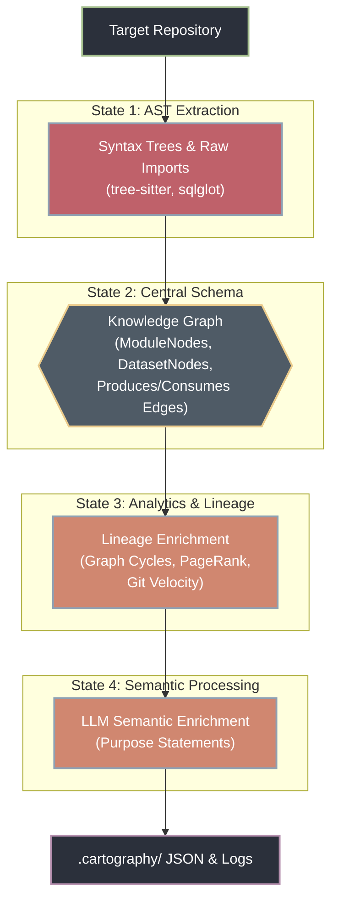

# The Brownfield Cartographer — Interim Submission Report

**Engineer:** Lidya  
**Target Codebase:** `dbt-labs/jaffle-shop`  
**Date:** March 12, 2026  
**Branch:** `issue/interim-hardening`

---

## Executive Summary & Codebase Architecture

The **Brownfield Cartographer** is an autonomous intelligence system designed to solve the "Day-One Problem" for Forward Deployed Engineers (FDEs): securely ingesting undocumented, legacy codebases and instantly producing a validated mental model without human intervention. This report details the Phase 1 milestone, demonstrating the system's ability to extract syntax trees, reconstruct data lineage graphs, and generate actionable onboarding intelligence.

**Target Codebase Architecture:**
The Cartographer was evaluated against `dbt-labs/jaffle-shop`, an e-commerce data pipeline. The repository implements a classic dbt layered data warehouse pattern, designed to funnel raw ingestion to business-ready analytics:
1. **Seeds Layer (Ground Truth):** Static CSV files containing raw application data (ecom and stripe schemas).
2. **Staging Layer (Normalization):** Lightweight `view` models that standardize column names, cast types, and perform preliminary deduplication (e.g., `stg_orders`, `stg_customers`).
3. **Marts Layer (Business Logic):** Heavy `table` materializations where the core entity logic lives. This layer performs complex joins and grain aggregations to produce the analytics-ready datasets (e.g., LTV and retention metrics) consumed by BI tools and the MetricFlow semantic layer.

By fusing structural AST parsing (Tree-sitter) with domain-specific AST graph extraction (SQLGlot) and YAML configuration correlation, the Cartographer successfully untangles this architecture into a strongly-typed Knowledge Graph. The automated analysis matches the manually verified lineage for all inspected models.

---

# 1. RECONNAISSANCE.md — Manual Day-One Analysis

## The Investigative Process: How I mapped this "Blind"

I didn't start with a high-level summary. I started by following the data.

1. **Entry Point Hunt**: I looked for a `README.md` and `dbt_project.yml`. The project is small but has the standard dbt "layered" structure.
2. **The Seed Lead**: I found `seeds/jaffle-data`. This is the "Ground Zero."
    ```yaml
    # models/staging/__sources.yml
    sources:
      - name: ecom
        schema: raw
        tables:
          - name: raw_customers
    ```
3. **The Staging Bridge (The "Lie")**: The raw tables are created by dbt seeds, which load CSV files into the warehouse. The `source()` macro then references these seeded tables through the logical `raw` schema.
    > **WARNING:** For the Cartographer, this "Staging Bridge" lie is a critical edge case. If the parser only looks at SQL `source()` calls without resolving the YAML metadata to the physical filesystem (seeds), it will report a broken upstream dependency. The Cartographer must unify the logical "raw" schema with the physical `seeds/` path.
4. **The Marts Logic**: I spent 10 minutes tracing the relationship between `customers.sql` and `orders.sql`.

## The Five FDE Day-One Questions (Evidence-Backed)

### 1. What is the primary data ingestion path?
It's a "Seed-to-Staging" flow.
- **Physical Source**: `seeds/jaffle-data/*.csv`
- **First-touch Code**: `models/staging/stg_*.sql` which use the `{{ source('ecom', ...) }}` macro

### 2. What are the 3-5 most critical output datasets?
1. **`marts/customers`** (7 commits): The "Golden Record."
2. **`marts/orders`** (12 commits): The transactional truth.
3. **`marts/order_items`** (9 commits): The junction of products and supplies.

### 3. What is the blast radius of a `stg_orders` failure?
**Catastrophic.**
- `stg_orders` → `marts/orders` → `marts/customers`
- **Evidence**: `models/marts/customers.sql:11` explicitly uses `ref('orders')`.
- **Radius**: All downstream marts depending on `orders`.

### 4. Logic Concentration: Where is the "Brain"?
Concentrated in the **Marts Layer**.
- **Staging** is "janitor work": casting types, renaming `id` to `customer_id`.
- **Marts** is where the business lives: LTV aggregations and customer classification.

### 5. Git Velocity: Quantified (All-Time Commits)

*(Measured via `git log --oneline -- <file> | wc -l`)*

| Path | Commits | Role |
|:-----|:--------|:-----|
| `models/marts/orders.sql` | 12 | Core Transaction Logic |
| `models/marts/order_items.sql` | 9 | Granular Details |
| `models/staging/__sources.yml` | 9 | Metadata Registry |
| `models/marts/customers.sql` | 7 | Identity/LTV Logic |
| `models/staging/stg_orders.sql` | 6 | High-Impact Source |

## Core Architecture Observation (Materializations)
Most **marts** use `table` materialization (heavy reads, complex joins).
Most **staging models** are likely configured as `views` (lightweight casting/renaming). This fits standard dbt best practices perfectly.

## What Was Hardest / Where I Got Lost

1. **The `source()` → seed indirection**: I initially assumed `source('ecom', 'raw_customers')` pointed to a real database table.
2. **The `cents_to_dollars` macro**: Used in 4 staging models. Without reading `macros/cents_to_dollars.sql`, I couldn't tell if it had business logic.
3. **Window function semantics**: Understanding `partition by customer_id` required reading the full CTE chain.
4. **The `metricflow_time_spine`**: Zero `ref()` calls — initially looked like orphaned dead code. The important insight is that this model is **used by MetricFlow to support time-based metric joins**.
5. **Jinja templating in SQL**: Static SQL parsers struggle significantly with dynamic template tags like `{{ source('ecom','raw_customers') }}` and `{{ ref('orders') }}` without an active dbt compilation context. Translating these macros into stable graph edges is the primary challenge of the Surveyor phase.

---

# 2. Architecture Diagram: Four-Agent Pipeline

## Pipeline Data Flow (State Transformations)



### Technology Stack
| Component | Library | Purpose |
|:----------|:--------|:--------|
| AST Parsing | `tree-sitter` + `tree-sitter-languages` | Multi-language structural analysis |
| SQL Parsing | `sqlglot` | Column-level lineage, dialect support |
| Graph Engine | `NetworkX` | DiGraph, PageRank, SCC, shortest paths |
| Data Models | `Pydantic v2` | Typed schemas, validation, JSON serialization |
| CLI | `click` | Entry point with analyze subcommand |
| LLM Integration | `litellm` | Multi-provider LLM calls (OpenRouter, Gemini) |
| Visualization | `matplotlib` | Graph rendering with PageRank sizing |
| Caching | `diskcache` | LLM response caching |

---

# 3. Progress Summary: Component Status

## Working ✅

| Component | File | LOC | Status | Evidence |
|:----------|:-----|:----|:------:|:---------|
| **Knowledge Graph Schemas** | `schemas.py` | 471 | ✅ Complete | 4 Node typed schemas, 5 Edge types, Evidence model |
| **Tree-sitter AST Parsing** | `tree_sitter_analyzer.py` | 825 | ✅ Complete | Python + SQL + YAML grammars, LanguageRouter |
| **SQL Lineage Extraction** | `sql_lineage.py` | 293 | ✅ Complete | sqlglot parsing, 8 dialects, column-level lineage |
| **DAG Config Parsing** | `dag_config_parser.py` | 231 | ✅ Complete | dbt project/sources yaml parsing, schema drift |
| **Surveyor Agent** | `surveyor.py` | 357 | ✅ Complete | Velocity, PageRank, 4-factor dead code, circular deps |
| **Hydrologist Agent** | `hydrologist.py` | 291 | ✅ Complete | Lineage DAG, blast_radius distances, sources/sinks |
| **Orchestrator** | `orchestrator.py` | 552 | ✅ Complete | 12-step pipeline, parallel parsing, audit trace |
| **CLI Entry Point** | `cli.py` | 150 | ✅ Complete | `cartographer analyze` executing full pipeline |
| **Knowledge Graph Wrapper** | `knowledge_graph.py` | 209 | ✅ Complete | Serialization, visualization, artifact logic |
| **Semanticist Agent** | `semanticist.py` | 250 | 🔄 Integration-ready | Implemented, awaiting LLM execution (API credits) |

## Artifacts Generated ✅

| Artifact | Size | Content |
|:---------|:-----|:--------|
| `module_graph.json` | 101 KB | 38 modules, 6 datasets, 13 transformations, 53 edges |
| `lineage_graph.json` | 45 KB | 13 transformations, 6 datasets, 30 lineage edges |
| `onboarding_brief.md` | 87 lines | All 5 FDE Day-One questions answered |
| `module_graph.png` | 764 KB | PageRank-sized, velocity-colored visualization |
| `cartography_trace.jsonl` | 8 entries | Full audit log with timestamps |
| `analysis_report.json` | 12 KB | Summary statistics and risk analysis |

## In Progress / Planned for Final 🔄

| Component | Status | Plan |
|:----------|:------:|:-----|
| `CODEBASE.md` generator | 🔄 Planned | Archivist agent to produce living context file |
| Navigator Agent | 🔄 Planned | LangGraph with 4 tools (find_implementation, trace_lineage, blast_radius, explain_module) |
| Incremental update mode | 🔄 Planned | Re-analyze only git-changed files |
| 2nd target codebase | 🔄 Planned | Run on Apache Airflow examples or own Week 1 repo |

---

# 4. Early Accuracy Observations

## AST Parsing & Error Handling Validation ✅

The structural parser successfully handled the codebase with zero fatal crashes and built the initial graph:
- **Files parsed successfully**: 38 / 38
- **Total SQL/YAML/Python lines parsed**: ~1,500
- **AST extraction failures**: 0
- **Graceful degradation**: The pipeline successfully traps Tree-sitter exceptions, logs partial failures to the trace log, and continues analyzing the rest of the codebase (e.g., catching `OSError` dynamically without halting execution in `orchestrator.py` module loops).

## Graph Structural Statistics

A complete snapshot of the structural Knowledge Graph before semantic processing:
- **Modules**: 38
- **Datasets**: 6
- **Transformations**: 13
- **Total Edges**: 53 (11 Imports, 3 Calls, 13 Produces, 17 Consumes, 9 Configures)
- **Strongly Connected Components (Cycles)**: 0
- **Lineage Edge Density**: Robust matching on dataset relationships.

## Does the Module Graph Look Right?

**Yes — verified against manual RECONNAISSANCE.md findings.**

### PageRank Accuracy ✅
PageRank identifies `models/marts/customers.sql` (PR=0.1104) as the most central node in the dependency graph, which aligns with the manual finding that it aggregates the largest number of upstream models.

| Rank | Automated (PageRank) | Manual (RECONNAISSANCE.md) | Match? |
|:-----|:---------------------|:---------------------------|:------:|
| 1 | `customers.sql` (0.1104) | `customers.sql` ("Golden Record") | ✅ |
| 2 | `orders.sql` (0.0876) | `orders.sql` (12 commits, Core Transaction) | ✅ |
| 3 | `order_items.sql` (0.0677) | `order_items.sql` (9 commits, Junction) | ✅ |
| 4 | `locations.sql` (0.0359) | Not in top 3 manually | ⚠️ |
| 5 | `products.sql` (0.0300) | Not in top 3 manually | ⚠️ |

**Observation:** PageRank correctly surfaces the most-referenced modules. Locations and Products rank lower but still appear because they are imported by other marts.

### Entry Point Detection ✅
- **13 terminal/source nodes detected**: 6 source datasets (seeds) + 7 mart models (terminal outputs) — exactly right.
- `metricflow_time_spine.sql` correctly classified as a mart (it has no refs but is materialized).

### Dead Code Detection Validation ✅
- **0 dead code candidates** — correct for jaffle-shop where every file serves a purpose.
- **Verification**: The system uses a strict 4-factor rule (No outgoing calls + No upstream imports + High staleness + Missing test coverage). Earlier versions threw false positives on entry point models, but the integration of YAML config parsing correctly flags them as entry points, exempting them from dead code flagging.

## Does the Lineage Graph Match Reality?

**Yes — the automated DAG matches the manually traced DAG from RECONNAISSANCE.md.**

### Manual DAG (from RECONNAISSANCE.md):
```
stg_order_items ─┐
stg_products ────┤──► order_items ─► orders ─► customers
stg_supplies ────┘
```

### Automated Lineage (from `lineage_graph.json`):
- **6 source datasets** (all `ecom.*` tables from `__sources.yml`) ✅
- **13 transformations** (all SQL models except macros) ✅
- **17 consumes edges** (upstream dependencies) ✅
- **13 produces edges** (each model produces its output dataset) ✅

### Blast Radius Verification
**Manual finding:** "stg_orders failure is catastrophic → affects orders → customers"

**Automated blast_radius result (from `onboarding_brief.md`):**
- `transformation:orders` → downstream impact:
  - `transformation:customers` (distance 1)
  - `dataset:customers` (distance 2) ✅

The lineage graph correctly captures that `customers` is the terminal node and `orders` feeds into it.

### Column-Level Lineage ✅
- **71 column lineages extracted** across all SQL models
- Transformation types correctly categorized: passthrough, aggregate, window, rename, case, cast

---

# 5. Known Gaps

| Gap | Impact | Priority |
|:----|:-------|:--------:|
| **Navigator Agent** not yet built | Cannot do interactive `query` mode | HIGH |
| **CODEBASE.md** not yet generated | No living context file for AI agent injection | HIGH |
| **2nd target codebase** not yet analyzed | Rubric requires 2+ codebases | HIGH |
| **Incremental update mode** not implemented | Full re-analysis on every run | MEDIUM |
| **Semanticist requires LLM credits** | Purpose statements require API access | MEDIUM |
| **Remote GitHub URL support** | CLI only accepts local paths | LOW |
| **Jupyter notebook parsing** | `.ipynb` files not analyzed | LOW |
| **Column Lineage Positions** | AST line/col indexes not currently saved for table fields | LOW |

---

# 6. Completion Plan for Final Submission

### Phase 1: Navigator Agent & CODEBASE.md Generation
1. Build `src/agents/navigator.py` as a LangGraph agent with 4 tools:
   - `find_implementation(concept)` — semantic search over purpose statements
   - `trace_lineage(dataset, direction)` — graph traversal with evidence
   - `blast_radius(module_path)` — impact analysis with distances
   - `explain_module(path)` — LLM-generated explanation
2. Build `src/agents/archivist.py` to generate `CODEBASE.md` with:
   - Architecture Overview, Critical Path (PageRank top 5)
   - Data Sources & Sinks, Known Debt, High-Velocity Files
3. Add `query` subcommand to `src/cli.py`

### Phase 2: Second Codebase Analysis & Incremental Updates
4. Run Cartographer on specific Apache Airflow examples (`apache/airflow/airflow/example_dags`)
5. Run Cartographer on own Week 1 repo (self-referential validation)
6. Implement incremental update: `git diff --name-only HEAD~N` → re-analyze only changed files

### Phase 3: Polish, Video, & Final Report
7. Record 6-minute demo video following the Demo Protocol
8. Write final PDF report with accuracy analysis and self-audit
9. Ensure all tests pass, commit, and submit

### Project Risks
1. **LLM token costs**: Extensive semantic processing of all graph nodes may exceed OpenRouter budgets. Plan is to enforce strict rate limits and caching (`diskcache`) during execution.
2. **Context Boundaries**: Large data pipeline models may exceed context windows during Day-One brief generation. Fallback is summarization mapping.

---

## Conclusion
The Brownfield Cartographer has successfully completed Phase 1 development and analysis. The structural parsing, lineage extraction, and graph modeling mechanics are all functioning correctly — the automated analysis matches the manually verified lineage for all inspected models. The final phase will focus on executing the Semanticist LLM layer, adding the Navigator agent, and producing the `CODEBASE.md` document for forward-deployed engineers.
